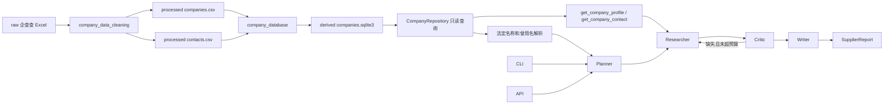

# 架构

## 当前原则

企查查清洗 CSV 是企业事实标准，SQLite 是可重复生成的查询产物。Agent 只能陈述当前数据源能够支持的工商和联系方式事实，不能把数据缺失解释为没有风险。

## 运行结构

## 数据层

### 标准数据源

- `data/procurement/processed/companies.csv`
- `data/procurement/processed/contacts.csv`
- `data/procurement/processed/rejected.csv`

真实数据受使用限制并由 Git 忽略。测试使用字段结构相同的合成 CSV。

### SQLite

默认路径为 `data/procurement/derived/companies.sqlite3`，schema version 为 1：

- `companies`：工商标量字段，信用代码主键。
- `company_aliases`：曾用名和规范化名称。
- `company_contacts`：电话、邮箱和通信地址。
- `import_metadata`：源文件哈希、计数、版本和生成时间。

法定名称、别名、登记状态、省市、国标行业大类和企业规模均有索引。数据库通过临时文件构建，校验和事务成功后才替换旧文件。

### Repository

`CompanyRepository` 使用 SQLite 只读连接，提供：

- `get_by_credit_code()`
- `get_contact()`
- `resolve_text()`

名称采用 NFKC、大小写折叠和空白折叠。中文使用子串匹配，英文使用字母数字边界；多企业命中返回歧义，不猜测实体。

## 正式模型

`CompanyProfile` 和 `CompanyContact` 对应清洗数据源。金额、日期、人数、年份和布尔字段进入 Pydantic 后使用真实类型；空字符串转为 `None`；别名、电话和邮箱转为列表。

当前不包含以下旧模型：

- SupplierCapability
- ComplianceProfile
- FinancialProfile
- ProcurementHistory
- SupplierDueDiligenceProfile

未来只有在获得对应数据源后才重新设计这些结构。

## Agent 编排

采购 Domain Pack 只包含六个维度：

1. `company_identity`
2. `registration`
3. `capital`
4. `industry_and_business_scope`
5. `enterprise_scale`
6. `contact`

Planner 通过 Repository 解析企业；Researcher 调用两个只读私有数据工具；Critic 检查六个维度的证据覆盖；Writer 始终返回 `insufficient_evidence`，并列出尚未接入的制裁、司法、新闻、财务、产能交期和采购履约数据。

## 接口

- CLI 支持 `--database` 指定数据库。
- FastAPI 通过 `create_app(database_path)` 注入数据库，模块级 `app` 使用默认路径。
- API 响应继续使用 `SupplierReport`，保持现有外形。

## 后续能力

- 经营范围条款感知分块。
- 中文分词和 SQLite FTS5/BM25。
- 制裁、司法、新闻、财务和采购履约独立数据源。
- RAGAS 评估、Phoenix 轨迹调试和 golden cases。
- 向量检索、GraphRAG、MCP 和持久化 checkpoint。
