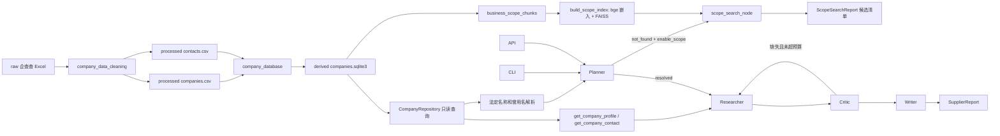

# 架构

## 当前原则

企查查清洗 CSV 是企业事实标准，SQLite 是可重复生成的查询产物。Agent 只能陈述当前数据源能够支持的工商、联系方式和经营范围事实，不能把数据缺失解释为没有风险；按经营范围语义检索到企业不等于采购背书。

## 运行结构

## 数据层

### 标准数据源

- `data/procurement/processed/companies.csv`
- `data/procurement/processed/contacts.csv`
- `data/procurement/processed/rejected.csv`

真实数据受使用限制并由 Git 忽略。测试使用字段结构相同的合成 CSV。

### SQLite

默认路径为 `data/procurement/derived/companies.sqlite3`，schema version 为 2：

- `companies`：工商标量字段，信用代码主键。
- `company_aliases`：曾用名和规范化名称。
- `company_contacts`：电话、邮箱和通信地址。
- `business_scope_chunks`：经营范围切块（信用代码、段标签、序号、文本、embedding BLOB）。
- `scope_index_metadata`：嵌入模型名、维度、归一化、chunk 数、构建时间。
- `import_metadata`：源文件哈希、计数、版本和生成时间。

法定名称、别名、登记状态、省市、国标行业大类、企业规模和 chunk 的信用代码均有索引。数据库通过临时文件构建，校验和事务成功后才替换旧文件。切块在建库时写入（`embedding` 为空）；嵌入与 FAISS 索引由单独的 `scripts/build_scope_index.py` 重建。

### Repository

`CompanyRepository` 使用 SQLite 只读连接，提供：

- `get_by_credit_code()`
- `get_contact()`（直接查 `company_contacts`，不重建整行）
- `resolve_text()`
- `get_scope_chunks()` / `get_scope_index_metadata()`（供 scope 检索映射 chunk 与校验索引模型）

名称采用 NFKC、大小写折叠和空白折叠。中文使用子串匹配，英文使用字母数字边界；匹配文本被更具体（更长且包含它）的命中支配时丢弃以避免假歧义；多企业命中返回歧义，不猜测实体。

## 正式模型

`CompanyProfile` 和 `CompanyContact` 对应清洗数据源。金额、日期、人数、年份和布尔字段进入 Pydantic 后使用真实类型；空字符串转为 `None`；别名、电话和邮箱转为列表。

当前不包含以下旧模型：

- SupplierCapability
- ComplianceProfile
- FinancialProfile
- ProcurementHistory
- SupplierDueDiligenceProfile

未来只有在获得对应数据源后才重新设计这些结构。

## Agent 编排

采购 Domain Pack 只包含六个维度：

1. `company_identity`
2. `registration`
3. `capital`
4. `industry_and_business_scope`
5. `enterprise_scale`
6. `contact`

Planner 通过 Repository 解析企业；`resolved` 进 Researcher（六维度工商核验，Writer 始终返回 `insufficient_evidence`）；`not_found` 且启用 scope 时进 `scope_search_node` 走经营范围语义检索，输出 `ScopeSearchReport`；其余（`ambiguous`、未启用 scope 的 `not_found`）进 Writer 输出无法解析报告。

## 经营范围语义检索（`rag/`）

跨企业按经营内容找企业。链路：条款感知切块（每条经营项一个 chunk，`***` 切段、`、；，。` 切项、剥标准免责括注）→ 本地 bge-small-zh-v1.5 嵌入（归一化，查询端加指令前缀）→ FAISS `IndexIDMap(IndexFlatIP)`（内积即余弦）→ `ScopeRetriever`。命中复用 `Evidence`/`Citation`，按企业分组为 `ScopeCandidate`。

- 依赖 `.[rag]` 可选 extra（`faiss-cpu`、`sentence-transformers`、`numpy`）。
- SQLite 是事实源（含 chunk 文本与向量），`scope_index.faiss` 是可重建派生索引。
- `run_research(enable_scope=True)` 时懒加载 `rag` 并注入 scope 节点；缺 `.[rag]`/索引/模型则降级为“不可用”报告，主图 import 不依赖 faiss/torch。

## 接口

- CLI 支持 `--database` / `--index`；默认 `enable_scope=True`，按问题类型自动分流（指名企业→核验，能力描述→scope 检索）。
- 独立 `rag.cli` 直接暴露 `ScopeRetriever`（不经 Agent 编排）。
- FastAPI 通过 `create_app(database_path)` 注入数据库，启动时按领域缓存编译图；模块级 `app` 使用默认路径。
- API 响应继续使用 `SupplierReport`，保持现有外形（`enable_scope` 默认关，不暴露 scope）。

## 后续能力

- 方案 B：scope 筛选 top-N 后对每家自动跑工商核验（便利层，按 YAGNI 缓做）。
- `/research` API 端到端暴露 scope。
- 制裁、司法、新闻、财务和采购履约独立数据源。
- ruff + mypy 静态检查。
- RAGAS 评估、Phoenix 轨迹调试和 golden cases。
- GraphRAG、MCP、Qdrant 和持久化 checkpoint。
