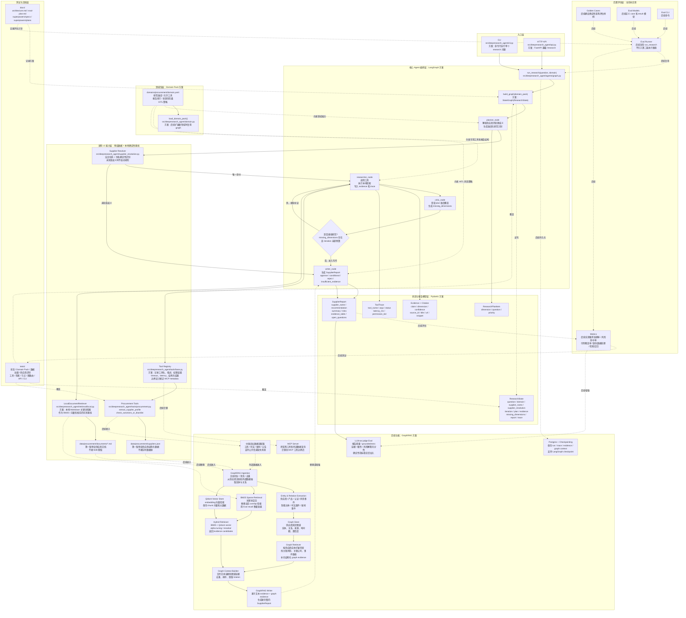
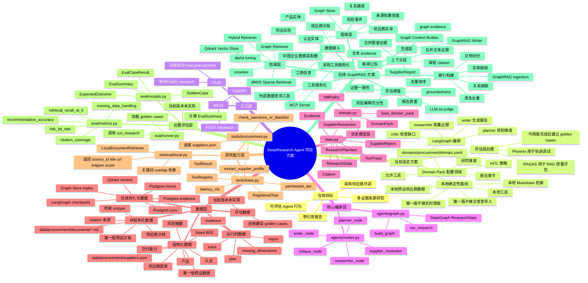

# 架构

## 核心循环

v1 graph 选择 LangGraph，而不是普通线性 chain。供应商尽调不是一次性问答：Agent 需要规划研究维度、收集证据、检查覆盖率，并在证据缺失时回到检索和工具调用阶段继续补证。

## 项目整体结构图

这张图展示的是项目结构，而不是实施计划。当前采用 LangGraph 做研究编排，用 Domain Pack 做领域配置，用确定性本地工具、本地检索和预设供应商数据做 v1 基线。评估层、企查查导入、B2B 采集、实时爬取和 GraphRAG 均后置。

## 项目思维导图

## 节点

- `planner`：通过预设法定名称和别名确定性识别供应商；唯一命中后创建研究计划，未知或歧义时直接进入证据不足报告。
- `researcher`：调用确定性采购工具和本地检索。
- `critic`：根据 plan 检查 evidence 覆盖情况。
- `writer`：生成带引用的供应商尽调报告；供应商未解析时生成 `insufficient_evidence` 报告。

## 领域包边界

采购领域包位于 `domains/procurement/domain.yaml`。后续新增领域时，应通过各自的 domain pack 定义研究维度、允许工具、报告章节、来源优先级和 HITL 规则，而不是重写 graph。

## 工具边界

v1 工具注册表记录工具名、描述、权限层级、timeout、latency 和结构化结果。这个设计有意接近 MCP tool metadata，方便在后续里程碑中把工具迁移到 MCP server 后面。
