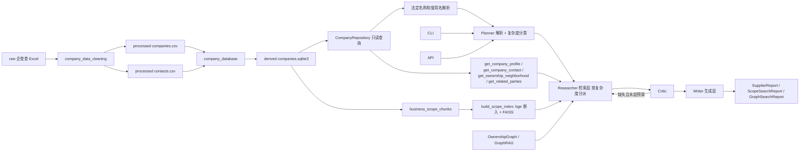

# 架构

## 当前原则

企查查清洗 CSV 是企业事实标准，SQLite 是可重复生成的查询产物。Agent 只能陈述当前数据源能够支持的工商、联系方式和经营范围事实，不能把数据缺失解释为没有风险；按经营范围语义检索到企业不等于采购背书。

## 运行结构

## 数据层

### 标准数据源

- `data/procurement/processed/companies.csv`
- `data/procurement/processed/contacts.csv`
- `data/procurement/processed/rejected.csv`

真实数据受使用限制并由 Git 忽略。测试使用字段结构相同的合成 CSV。

### SQLite

默认路径为 `data/procurement/derived/companies.sqlite3`，schema version 为 2：

- `companies`：工商标量字段，信用代码主键。
- `company_aliases`：曾用名和规范化名称。
- `company_contacts`：电话、邮箱和通信地址。
- `business_scope_chunks`：经营范围切块（信用代码、段标签、序号、文本、embedding BLOB）。
- `scope_index_metadata`：嵌入模型名、维度、归一化、chunk 数、构建时间。
- `import_metadata`：源文件哈希、计数、版本和生成时间。

法定名称、别名、登记状态、省市、国标行业大类、企业规模和 chunk 的信用代码均有索引。数据库通过临时文件构建，校验和事务成功后才替换旧文件。切块在建库时写入（`embedding` 为空）；嵌入与 FAISS 索引由单独的 `scripts/build_scope_index.py` 重建。

### Repository

`CompanyRepository` 使用 SQLite 只读连接，提供：

- `get_by_credit_code()`
- `get_contact()`（直接查 `company_contacts`，不重建整行）
- `resolve_text()`
- `get_scope_chunks()` / `get_scope_index_metadata()`（供 scope 检索映射 chunk 与校验索引模型）

名称采用 NFKC、大小写折叠和空白折叠。中文使用子串匹配，英文使用字母数字边界；匹配文本被更具体（更长且包含它）的命中支配时丢弃以避免假歧义；多企业命中返回歧义，不猜测实体。

## 正式模型

`CompanyProfile` 和 `CompanyContact` 对应清洗数据源。金额、日期、人数、年份和布尔字段进入 Pydantic 后使用真实类型；空字符串转为 `None`；别名、电话和邮箱转为列表。

当前不包含以下旧模型：

- SupplierCapability
- ComplianceProfile
- FinancialProfile
- ProcurementHistory
- SupplierDueDiligenceProfile

未来只有在获得对应数据源后才重新设计这些结构。

## Agent 编排

采购 Domain Pack 只包含六个维度：

1. `company_identity`
2. `registration`
3. `capital`
4. `industry_and_business_scope`
5. `enterprise_scale`
6. `contact`

图是纯线性 `planner → researcher → critic → writer → END`，检索与生成分层（C2）：

- **planner**：`resolve_supplier` 解析企业 + `classify_complexity` 写入 `state.complexity`（LLM 只发查询文本，无 key/无 `.[llm]` 走确定性启发式），不检索。
- **researcher = 检索层**：按 `解析状态 × 复杂度 × 是否启用检索` 选模式并只做检索，结果落到 state（不写报告叙述）：
  - `resolved` → `named`：调四个私有工具（profile/contact/ownership/related）拆成研究维度 `Evidence`；
  - `not_found` + `simple` → `scope`：经营范围语义检索，填 `scope_candidates`；
  - `not_found` + `medium/complex` → `graph`：GraphRAG 融合（候选 + 最终控制人 + 共享控制人），填 `graph_candidates`/`shared_controllers`；图检索器缺失且 scope 可用时回退 `scope`；
  - `ambiguous` 或均未启用检索 → `unresolved`：不检索。
  - **降级链（C4）**：graph **运行时抛异常** → 有 scope 就降级 scope（`retrieval_available` 重置为 True 重试 scope）、无 scope 则记"无可用降级路径"；scope 运行时异常 → 终点"不可用"。**运行时失败**追加到 `state.degradations`（配置性缺失——检索器为 None——不记，保持告警信号纯净）。检索器缺失/异常置 `retrieval_available=False`，不抛出。
- **critic**：计划维度减已覆盖维度算缺口，非空且未超预算（`iteration < 3`）回 researcher（实际只有 `named` 路径会累积维度、可能回环）。
- **writer = 生成层**：唯一报告生成者，按 `retrieval_mode` 产出 `SupplierReport`(named/unresolved) / `ScopeSearchReport`(scope) / `GraphSearchReport`(graph)，所有 summary/open_questions/`insufficient_evidence`/人工复核提示都在此生成；检索器不可用时产出对应"不可用"报告。`state.degradations` 被插入报告 `open_questions` 最前面，让降级过程可见。

`enable_scope`/`enable_graph` 由 CLI 和网页会话端点控制（`--graph` 从"强制图检索"变为"允许图检索，由复杂度决定用不用"）；`/research` API 不启用检索、形状不变。旧的 `scope_search_node`/`graph_search_node` 独立节点与 planner 后条件路由已撤销，检索/生成职责收口到 researcher/writer 两层。

## 经营范围语义检索（`rag/`）

跨企业按经营内容找企业。链路：条款感知切块（每条经营项一个 chunk，`***` 切段、`、；，。` 切项、剥标准免责括注）→ 本地 bge-small-zh-v1.5 嵌入（归一化，查询端加指令前缀）→ FAISS `IndexIDMap(IndexFlatIP)`（内积即余弦）→ `ScopeRetriever`。命中复用 `Evidence`/`Citation`，按企业分组为 `ScopeCandidate`。

- 依赖 `.[rag]` 可选 extra（`faiss-cpu`、`sentence-transformers`、`numpy`）。
- SQLite 是事实源（含 chunk 文本与向量），`scope_index.faiss` 是可重建派生索引。
- `run_research(enable_scope=True)` 时懒加载 `rag` 并把 retriever 注入 researcher（不再是独立节点）；缺 `.[rag]`/索引/模型则由 writer 降级为“不可用”报告，主图 import 不依赖 faiss/torch。

## 记忆层（`memory/`）

两层记忆，经 `run_research(session=, memory=, enable_memory=)` 与 `cli chat` 接入，默认关、`/research` API 不动。

- **会话最近实体缓冲**（`session.py`，确定性、零 LLM）：`Session.recent_entities` 存最近 resolved 实体；`resolve_anaphora` 在句含 `它/该公司/上述` 等标记时返回最近实体。planner 仅在直接解析 `not_found` 时回退该实体（`state.preresolved`）。
- **mem0 语义记忆**（`service.py`/`config.py`，跨会话）：`MemoryService.recall/remember` 包 mem0；抽取走云端 DeepSeek（`MemoryConfig.deepseek`，OpenAI 兼容），嵌入用本地 bge，向量库本地 Chroma。缺依赖/缺 key/异常 → `memory_available=False` 或 no-op 降级。
- **数据流（一轮）**：指代解析→`preresolved`；`recall`→注入报告 `open_questions`（标注「历史记忆」）；跑图；`note_entity`；`remember(问题+报告摘要)`。
- **红线**：本线经用户决定豁免数据本地化、抽取走云端；本地 Ollama 接口保留（一段 config 可切回）。CI 零网络用 FakeMemoryBackend，真链路 `@pytest.mark.llm` 手验。
- **API 接入**：`POST /session/turn`（有状态多轮）经 `create_app` 注入 `MemoryService` 与 `JsonSessionStore`（`store.py`，JSON 文件每会话、原子写、跨进程）。授权靠 ownership（存储 owner≠请求 user_id→404，防 IDOR），session_id 严格 `^[A-Za-z0-9_-]{1,64}$` 防路径穿越，`uuid4` 缺省生成并始终回传。记忆编排由 `execute_turn`（`run_research` 与 API 共用）承担。`/research` 无状态一问一答不变。

## 接口

- CLI 支持 `--database` / `--index`；默认 `enable_scope=True`，按问题类型自动分流（指名企业→核验，能力描述→scope 检索）。`cli chat` 子命令承载多轮对话。
- 独立 `rag.cli` 直接暴露 `ScopeRetriever`（不经 Agent 编排）。
- FastAPI 通过 `create_app(database_path, memory=, session_store=, index_path=, enable_scope=, enable_graph=)` 注入数据库/记忆/会话存储与检索配置，按领域和检索开关缓存编译图；模块级 `app` 使用默认路径。
- `/research` 保持 `SupplierReport` 外形且不构建检索器；`/session/turn` 与 `/session/turn/stream` 默认注入 scope/graph 检索器，能力查询可返回 scope 或 graph 报告。
- `POST /session/turn` 为有状态多轮端点：请求体 `user_id` 作 authenticated user（无鉴权层 stand-in），`session_id` 只寻址不授权；响应 `{session_id, report}`，其中 `report` 可为命名核验、scope 或 graph 报告。
- **Web 聊天界面**（对外演示 Demo）：`GET /` 返 `web/index.html`、`/static` 挂 `StaticFiles` 托管 `web/{index.html,style.css,app.js}`；自包含 vanilla 页（零构建零 npm、无 CDN），发 `POST /session/turn` 后以「研究中…」加载态→结构化报告卡渲染 `SupplierReport`（recommendation 徽章四值映射、证据表带 `local://` 引用、待解问题=尚未接入数据源）；身份 `user_id` 存 localStorage、`session_id` 内存复用多轮指代。后端仅新增静态托管（`WEB_DIR=Path(__file__).parent/"web"`），端点逻辑不变。
- **网页流式呈现（DeepSeek）**：`POST /session/turn/stream`（SSE）建图时注入 scope/graph 检索器，呈现层走 `llm/deepseek.py::build_deepseek_polisher`（`stream=True` 逐 token）。三种报告经 `_resolve_report` 定稿后交 LLM 生成中文。**LLM 只呈现、不改结论**：`_render_report_for_llm` 转输入文本时剔除结论，`recommendation` 结论句由后端 `_conclusion_line` 在 LLM 正文前确定性硬发（纵深防御）；约束 `_PRESENTER_SYSTEM_PROMPT`（只复述/不推断/保留原文/围标标线索级）。降级：无 `DEEPSEEK_API_KEY`/LLM 异常→回退 `_report_message_chunks`；Neo4j 不可用时由图层降级 scope。`create_app(polisher="__default__")` 哨兵可注入。数据越境经用户明确豁免（呈现层，与记忆层同级）。
- **Neo4j 兜底**：`Neo4jBackend.from_env` 默认密码 `devpassword`（对齐 docker-compose，仅本地）；`create_app` 启动经 `logging` 打印 graph 后端连通性（`connected`/`unavailable`），不再静默降级。

## 后续能力

- 输入行业名 → 公司的直查路径（业务名→行业名模糊映射 + 语义 scope 兜底 + 新报告类型；N4 已做"同行业+同控制人"围标线索，此为另一条面向用户的行业检索入口，按需再评估）。
- 方案 B：scope 筛选 top-N 后对每家自动跑工商核验（便利层，按 YAGNI 缓做）。
- `/research` API 端到端暴露 scope。
- 制裁、司法、新闻、财务和采购履约独立数据源。
- ruff + mypy 静态检查。
- eval 扩展：真实 golden 起草工具已落地（`eval/golden_gen.py` + `scripts/generate_entity_golden.py`，从真库派生法定名/曾用名/歧义/not_found 四类企业识别题，真值取自 DB 事实、闭环 accuracy=1.0，写 gitignored 的 `*.local.yaml`、只回条数）；仍待：本地跑真实 P/R 数字、GraphRAG 精准率（人工抽检 via_person）、接入风险/推荐数据源后补对应指标；RAGAS/LLM-as-judge 待本地 LLM 就绪且确定性基线稳定后再评估。
- Phoenix 本地追踪已落地（`observability.py`，手动 span 在图层包四节点 + root span，`run_research(enable_tracing=True)`/CLI `--trace`，`.[trace]` extra；默认关、仅本地、不接 LLM-eval）。后续可补：单工具/单命中下钻 span、把 eval 指标接进 Phoenix Experiments。
- GraphRAG、MCP、Qdrant 和持久化 checkpoint。
